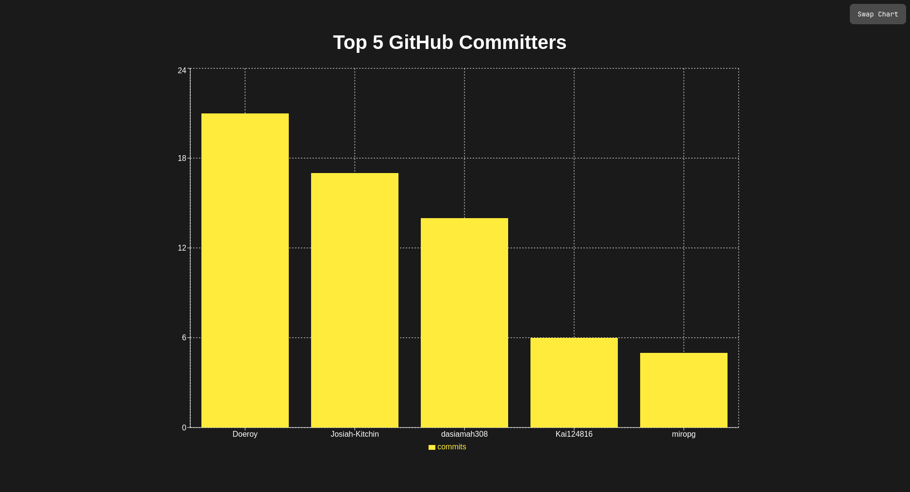

# GitRank

A website for displaying GitHub API stats during the hackathon.

## Charts
- Top 5 GitHub Committers
- Top 5 Repos with Most Commits




## How to Run Locally

### Backend
1. Create a virtual environment:
    ```bash
    python3 -m venv venv
    ```

2. (If you are on a Unix machine, you can use the Makefile to enter and start the server)

3. Install the required dependencies:
    ```bash
    pip install -r requirements.txt
    ```

4. Create a `.env` file based on the `.env_template` file.

5. The GitHub token can be created by navigating to GitHub -> Settings -> Developer Settings.

6. Fill the 'repos.txt' file with all the repos you want to use in your data set. Each url must be seperated by a new line

7. Run the server:
    ```bash
    python3 server.py
    ```

### Frontend
If you want to make changes to the fronend, you can work in the frontend in this repo 
or the QuackStats-Frontend, as its a submodule 

1. install the dependencies:
    ```bash
    npm install
    ```

2. To build the frontend:
    ```bash
    npm run build
    ```

